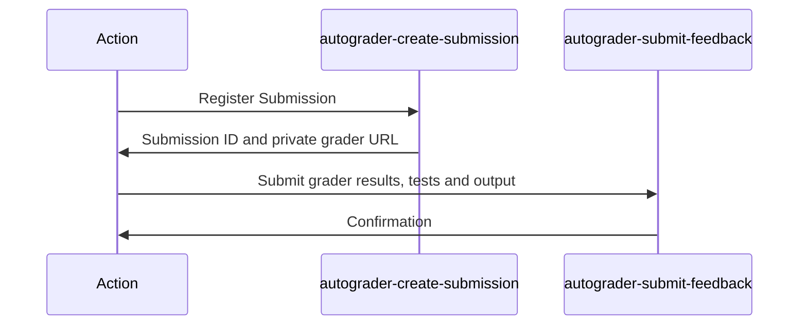

# Pawtograder Assignment Action

## Grading Overview

This action works closely with the
[Pawtograder](https://github.com/pawtograder/pawtograder) project. It invokes
two key Pawtograder Edge Functions, as shown below:



GitHub provides the action with an
[OIDC token](https://docs.github.com/en/actions/deployment/security-hardening-your-deployments/about-security-hardening-with-openid-connect),
which the `autograder-create-submission` function uses to authenticate that the
commit is coming from a known repository. It performs other security checks,
registers a `submission`, and returns a one-time URL to download the private
grader (the grader repository that is configured for the assignment).

Within the action, the `Grader` class is responsible for executing the grading
process, utilizing the `pawtograder.yml` configuration file in the grader
repository. This configuration file implements the `PawtograderConfig` interface
(see `src/grader/types.ts`).

Upon completion of the grading process, the `autograder-submit-feedback`
function is called with grading results, again relying on the GitHub OIDC token
to authenticate.

## Transpile before pushing

GitHub Actions will only run JS, so we need to transpile before pushing:

```bash
npm run build
```

The CI workflow will fail if the `dist/` directory does not match what is
expected from the build.
