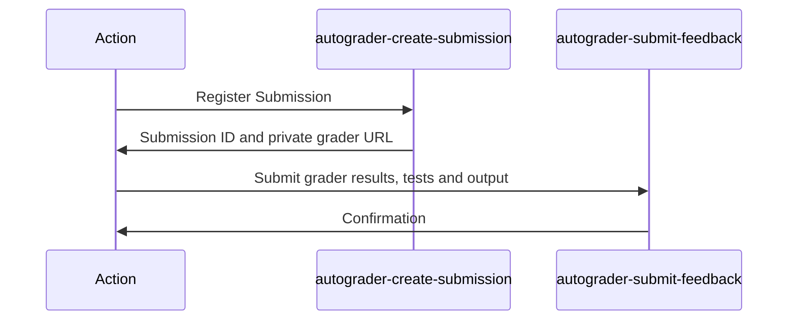

# Pawtograder Assignment Action

## Grading Overview

This action works closely with the
[Pawtograder](https://github.com/pawtograder/pawtograder) project. It invokes
two key Pawtograder Edge Functions, as shown below:



GitHub provides the action with an
[OIDC token](https://docs.github.com/en/actions/deployment/security-hardening-your-deployments/about-security-hardening-with-openid-connect),
which the `autograder-create-submission` function uses to authenticate that the
commit is coming from a known repository. It performs other security checks,
registers a `submission`, and returns a one-time URL to download the private
grader (the grader repository that is configured for the assignment).

Within the action, the `Grader` class is responsible for executing the grading
process, utilizing the `pawtograder.yml` configuration file in the grader
repository. This configuration file implements the `PawtograderConfig` interface
(see `src/grader/types.ts`).

Upon completion of the grading process, the `autograder-submit-feedback`
function is called with grading results, again relying on the GitHub OIDC token
to authenticate.

## Development tips

### Run the grader locally

To test changes to the grader, you can run it locally without invoking GitHub
Actions or interfacing with Pawtograder at all:

```bash
npx tsimp src/grader/main.ts -s /full/path/to/solution/repo -u /full/path/to/submission/repo
```

A significant amount of output will be printed to the console, including a
pretty-printed JSON object with the results of the grading that would be passed
along to Pawtograder.

### Transpile before pushing

GitHub Actions will only run JS, so we need to transpile before pushing:

```bash
npm run build
```

The CI workflow will fail if the `dist/` directory does not match what is
expected from the build.

## About the configuration file

The `pawtograder.yml` file is used to configure the autograder, and defines the
way to build the project and run the tests. This file is parsed by the
`pawtograder/assignment-action` to grade student code. That action abstracts the
details of building a project, linting it, grading unit tests, and even running
a mutation analysis on the student's tests. It also handles parsing output from
those tests and analyses.

The action takes the files that match the names and/or glob patterns in
`submissionFiles`.`files` and copies them into the corresponding location in
_the solution_ repository. Then, it runs the tests defined in _the solution_
repository. If you collect students' tests, you must define them in the
`submissionFiles`.`testFiles` section - this way you don't need to worry about
whether or not a student's test can overwrite one of yours (and we can do
mutation and other analyses on the test files).

## About the grading specification

The `gradedParts` section defines the parts of the assignment that are graded.
Each part has a name, and a list of units that are graded. `Parts` can be used
to seggregate functionality by multiple checkpoints of an assignment (e.g. show
"Part 1" tests all in one visual group with a part-level score, then show "Part
2" tests and so on). A `Part` can also be set to `hide_until_released` to
prevent students from seeing the output or score of tests in this part until
their submission is graded and released.

`gradedUnits` defines the units that are graded for a part, this is the lowest
level of granularity that can be graded. There are two kinds of `gradedUnit`:

- Regular test units are used for traditional test cases with point values. They
  have a name (displayed to students), a point value, and an array of test
  names. For JUnit, names are matched as prefixes of the test name using the
  Fully.Qualified.ClassName.testMethod pattern. Note that because it's both
  extremely convenient to specify many tests using a prefix and easy to mess up
  the points, you need to speciy the number of tests you expect to run. By
  default, points are only awarded if all tests are run and pass, or use
  `allow_partial_credit: true` to award `points*(Passed/Total)` points.
- Mutation test units are used for grading mutation analysis of student tests.
  Each Mutation test unit has a name, a list of locations (in the solution code)
  to expect mutants to be detected by students' tests (format:
  "file.name:lineStart-lineEnd"), and a list of scoring breakpoints. Breakpoints
  define the number of points to award based on the number of mutants detected
  within the specified locations, and are objects with keys
  `minimumMutantsDetected` and `pointsToAward`.
