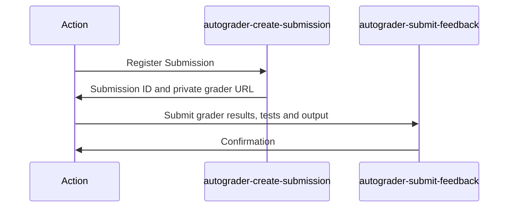

# Pawtograder Assignment Action

## Grading Overview

This action works closely with the
[Pawtograder](https://github.com/pawtograder/pawtograder) project. It invokes
two key Pawtograder Edge Functions, as shown below:


```mermaid
sequenceDiagram
    participant A as Action
    participant CS as autograder-create-submission
    participant SF as autograder-submit-feedback
    A->>CS: Register Submission
    CS->>A: Submission ID and private grader URL
    A->>SF: Submit grader results, tests and output
    SF->>A: Confirmation
```

GitHub provides the action with an
[OIDC token](https://docs.github.com/en/actions/deployment/security-hardening-your-deployments/about-security-hardening-with-openid-connect),
which the `autograder-create-submission` function uses to authenticate that the
commit is coming from a known repository. It performs other security checks,
registers a `submission`, and returns a one-time URL to download the private
grader (the grader repository that is configured for the assignment).

Within the action, the `Grader` class is responsible for executing the grading
process, utilizing the `pawtograder.yml` configuration file in the grader
repository. This configuration file implements the `PawtograderConfig` interface
(see `src/grader/types.ts`).

Upon completion of the grading process, the `autograder-submit-feedback`
function is called with grading results, again relying on the GitHub OIDC token
to authenticate.

## Development tips

### Run the grader locally

To test changes to the grader, you can run it locally without invoking GitHub
Actions or interfacing with Pawtograder at all:

```bash
npx tsimp src/grading/main.ts -s /full/path/to/solution/repo -u /full/path/to/submission/repo
```

Note: Be sure to use full paths from the root of your computer for the solution
and submission repos (avoid relative pathing)

A significant amount of output will be printed to the console, including a
pretty-printed JSON object with the results of the grading that would be passed
along to Pawtograder.

Every time you run the action, solution/student files get copied into a
temporary `pawtograder-grading/` directory. This directory persists after runs
for debugging purposes. Be sure to delete this directory after each run or else
you may face a EACCES copyfile error or get weird results with nested folders.

### Transpile before pushing

GitHub Actions will only run JS, so we need to transpile before pushing:

```bash
npm run bundle
```

The CI workflow will fail if the `dist/` directory does not match what is
expected from the build.

## About the configuration file

The `pawtograder.yml` file is used to configure the autograder, and defines the
way to build the project and run the tests. This file is parsed by the
`pawtograder/assignment-action` to grade student code. That action abstracts the
details of building a project, linting it, grading unit tests, and even running
a mutation analysis on the student's tests. It also handles parsing output from
those tests and analyses.

The action takes the files that match the names and/or glob patterns in
`submissionFiles`.`files` and copies them into the corresponding location in
_the solution_ repository. Then, it runs the tests defined in _the solution_
repository. If you collect students' tests, you must define them in the
`submissionFiles`.`testFiles` section - this way you don't need to worry about
whether or not a student's test can overwrite one of yours (and we can do
mutation and other analyses on the test files).

## About the grading specification

The `gradedParts` section defines the parts of the assignment that are graded.
Each part has a name, and a list of units that are graded. `Parts` can be used
to seggregate functionality by multiple checkpoints of an assignment (e.g. show
"Part 1" tests all in one visual group with a part-level score, then show "Part
2" tests and so on). A `Part` can also be set to `hide_until_released` to
prevent students from seeing the output or score of tests in this part until
their submission is graded and released.

`gradedUnits` defines the units that are graded for a part, this is the lowest
level of granularity that can be graded. There are two kinds of `gradedUnit`:

- Regular test units are used for traditional test cases with point values. They
  have a name (displayed to students), a point value, and an array of test
  names. For JUnit, names are matched as prefixes of the test name using the
  Fully.Qualified.ClassName.testMethod pattern. Note that because it's both
  extremely convenient to specify many tests using a prefix and easy to mess up
  the points, you need to speciy the number of tests you expect to run. By
  default, points are only awarded if all tests are run and pass, or use
  `allow_partial_credit: true` to award `points*(Passed/Total)` points.
- Mutation test units are used for grading mutation analysis of student tests.
  Each Mutation test unit has a name, a list of locations (in the solution code)
  to expect mutants to be detected by students' tests (format:
  "file.name:lineStart-lineEnd"), and a list of scoring breakpoints. Breakpoints
  define the number of points to award based on the number of mutants detected
  within the specified locations, and are objects with keys
  `minimumMutantsDetected` and `pointsToAward`.

## Dependencies

Both `gradedParts` and `gradedUnits` can have dependencies, which allow you to
conditionally grade parts or units based on the student's performance on other
parts or units. If dependencies are not met, the dependent part/unit will show a
message explaining which dependencies were not satisfied instead of the actual
grading results.

### Dependency Types

A dependency can be specified in three formats:

1. **String** (backward compatible): References a **part** by name, requires
   full marks (100%)

   ```yaml
   dependencies:
     - 'Part 1: Basics'
   ```

2. **Part reference object**: References a part with an optional `minScore`
   threshold (raw score value)

   ```yaml
   dependencies:
     - part: 'Part 1: Basics'
       minScore: 15 # Requires at least 15 points on Part 1
   ```

3. **Unit reference object**: References a specific unit with an optional
   `minScore` threshold (raw score value)
   ```yaml
   dependencies:
     - unit: 'Unit 1.1: Setup'
       minScore: 8 # Requires at least 8 points on Unit 1.1
   ```

### Behavior

- If `minScore` is omitted, the dependency requires **full marks** (score equals
  max score)
- If `minScore` is specified, the dependency requires the student to score **at
  least** that raw score value
- Dependencies can reference parts or units from anywhere in the configuration
- When a **part's** dependencies are not met, the entire part is replaced with a
  single feedback message
- When a **unit's** dependencies are not met (but the part's are satisfied),
  only that unit is replaced with a feedback message

### Example Configuration

```yaml
gradedParts:
  - name: 'Part 1: Basics'
    gradedUnits:
      - name: 'Unit 1.1: Setup'
        tests: '[T1.1'
        points: 10
        testCount: 5

      - name: 'Unit 1.2: Core'
        dependencies:
          - unit: 'Unit 1.1: Setup' # Requires 100% on Unit 1.1
        tests: '[T1.2'
        points: 15
        testCount: 8

  - name: 'Part 2: Advanced'
    dependencies:
      - 'Part 1: Basics' # String shorthand = part requiring full marks
    gradedUnits:
      - name: 'Unit 2.1: Advanced Ops'
        dependencies:
          - part: 'Part 1: Basics'
            minScore: 20 # Need at least 20 points on Part 1
          - unit: 'Unit 1.2: Core' # Need full marks on this unit
        tests: '[T2.1'
        points: 20
        testCount: 10
```

In this example:

- "Unit 1.2: Core" will only be graded if the student gets full marks on "Unit
  1.1: Setup"
- "Part 2: Advanced" will only be graded if the student gets full marks on all
  of "Part 1: Basics"
- "Unit 2.1: Advanced Ops" has additional unit-level dependencies requiring at
  least 20 points on Part 1 and full marks on Unit 1.2
